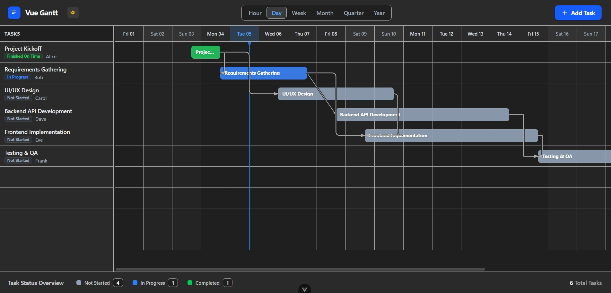
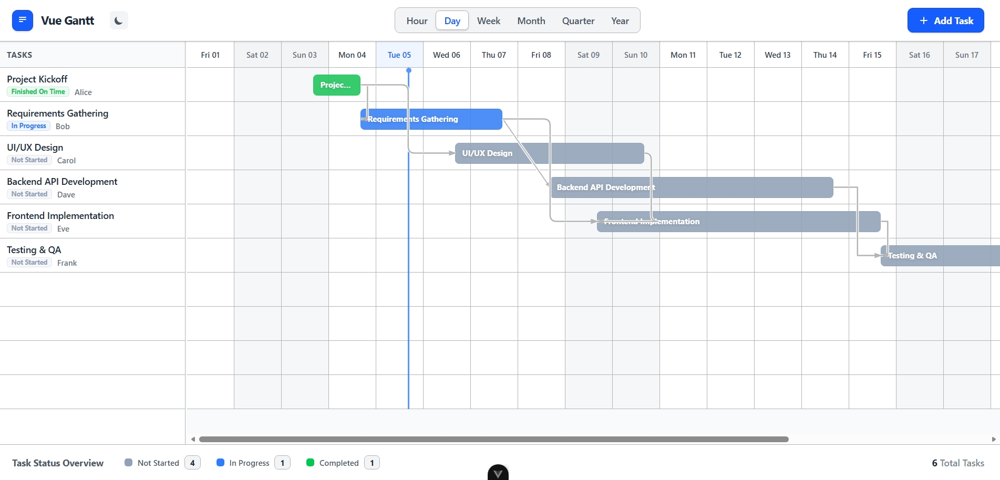

# Vue Open Gantt

### A simple, open-source Gantt and scheduling foundation built with Vue 3.

**Vue Open Gantt** is a clean, practical, and highly customizable scheduling foundation. It was built for developers who need a reliable Gantt-style timeline without the overhead or restrictive licenses of enterprise-grade software.

---

## Why This Exists

I built this because I struggled to find a Vue-based open-source Gantt or schedule tool that was simple, reliable, and easy to customize. 

Many available options were either too heavy, broke during initial setup, were not truly open-source, or were difficult to extend without fighting the underlying architecture. This project is my attempt to provide a clean, "developer-first" starting point for anyone who needs a Vue Gantt interface—without the frustration of battling complex tooling first.

---

## Features

- **Vue 3 + Composition API**: Modern, performant, and easy to read.
- **Multiple Calendar Views**: Support for Hour, Day, Week, Month, Quarter, and Year views.
- **Persistent Grid**: A reliable calendar grid that remains visible even when no tasks are present.
- **Task Management**: Create, edit, and delete tasks through an intuitive interface.
- **Work-Time Tracking**: 
    - Track **Planned** vs. **Actual** start and end date-times.
    - Integrated **Start Work** and **End Work** workflow.
    - **Automated Work Review**: Generates rule-based feedback (e.g., "Started on time, finished late") based on planned vs actual data.
- **Interactive Timeline**: 
    - Drag-and-drop to shift task dates.
    - Horizontal resizing to change task duration.
    - Snapping support (including 15-minute intervals in Hour view).
- **Dependency Visualization**: 
    - Render dependencies between tasks.
    - Supports **Smoothstep**, **Step**, and **Straight** edge styles.
    - Automatic dependency reconnection when deleting tasks in a chain.
- **User Interface**:
    - **Light & Dark Theme**: Automatic detection of system preference with manual toggle override.
    - **Resizable Panes**: Built-in splitter to resize or collapse the task table and timeline.
    - **Auto-Scroll**: Click a task in the sidebar to instantly navigate to its location on the timeline.
- **Professional Aesthetic**: Clean, neutral design using `#b4b4b4` (Light) and `#A9A9A9` (Dark) as the primary UI colors.

---

## Tech Stack

- **Vue 3**: The core framework using the Composition API for scalability.
- **Vite**: Ultra-fast build tool and development server.
- **TypeScript**: Robust type-safety across the entire application.
- **Tailwind CSS**: Powers the high-performance calendar grid, responsive layouts, and theming.
- **Pinia**: Centralized state management for tasks and UI preferences.
- **Element Plus**: Handles complex UI components like dialogs, forms, and confirmation prompts.
- **Vue Flow**: High-level engine used for rendering complex dependency nodes and edges.
- **PrimeVue & Chart.js**: Used for reporting and status breakdown visualizations.
- **Day.js**: Precise date and time calculations across all timeline views.

---

## Screenshots

### Project Preview





---

## Installation

```bash
# Clone the repository
git clone https://github.com/your-username/vue-open-gantt.git

# Navigate to the directory
cd vue-open-gantt

# Install dependencies
npm install
```

---

## Development

Run the development server with hot-reloading:

```bash
npm run dev
```

---

## Build

Compile and minify for production:

```bash
npm run build
```

---

## Usage Overview

### The Task Model
Tasks are stored in a centralized Pinia store (`task.store.ts`). Each task includes:
- `plannedStartDateTime` & `plannedEndDateTime`
- `actualStartDateTime` & `actualEndDateTime`
- `dependencies` (array of IDs)
- `dependencyEdgeType` (`smoothstep`, `step`, or `straight`)

### Theme Management
The app uses a `dark` class on the `<html>` element. It checks `prefers-color-scheme` on load but allows users to toggle manually via the `GanttToolbar`.

---

## Project Structure

```text
src/
├── components/
│   ├── gantt/            # Core Gantt sub-components (Timeline, Sidebar, etc.)
│   └── TaskDialog.vue    # Main task creation/edit interface
├── stores/
│   └── task.store.ts     # Global task state and logic
├── utils/
│   └── date.utils.ts     # Timeline and date calculation helpers
└── views/
    └── GanttView.vue     # Main layout assembly
```

---

## Main Concepts

- **Grid Rendering**: The timeline is a CSS Grid/Flexbox hybrid designed to handle large date ranges efficiently.
- **Dependency Logic**: Edges are rendered using SVG via Vue Flow. Deleting a middle node in a chain triggers a reconnection logic that bridges the gap between previous and subsequent tasks.
- **Automated Review**: A utility function calculates the delta between planned and actual timestamps to provide objective performance feedback.

---

## Roadmap

- [ ] Export to PDF / Image
- [ ] Multi-assignee support
- [ ] Task grouping and categories
- [ ] Zoom level shortcuts
- [ ] Localization (i18n)

---

## Contribution

Contributions are welcome! This is a community foundation.
1. Fork the Project
2. Create your Feature Branch (`git checkout -b feature/AmazingFeature`)
3. Commit your Changes (`git commit -m 'Add some AmazingFeature'`)
4. Push to the Branch (`git push origin feature/AmazingFeature`)
5. Open a Pull Request

---

## Known Limitations

- Designed for desktop-first interaction (drag/resize logic).
- Performance may vary with thousands of simultaneous dependency lines (optimized for typical project loads).

---

## License

Distributed under the MIT License. See `LICENSE` for more information.

---

## Maintainer

**Your Name / Organization** - [Your Website](https://yourwebsite.com)

---

## Open Source Note

This project is—and will always be—free and open-source. It is a gift to the Vue community to help simplify the complex world of timeline and schedule development.
